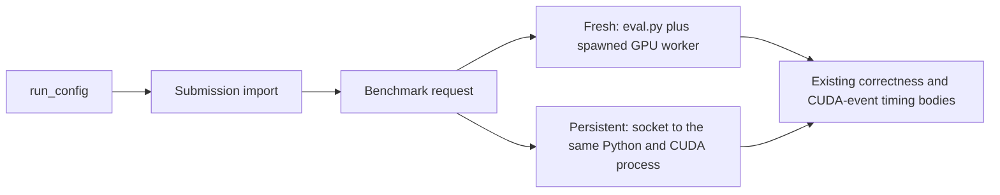

# Persistent evaluator experiment

KernelBot's warm Modal function still starts fresh Python processes for submission
import and evaluation. This experiment measures how much wall time can be saved
by retaining one Python interpreter and CUDA context across trusted submissions.
It does not modify or enable the production runner.

## Run

From the repository root, with Modal authentication configured:

```sh
uv run --no-project --with modal==1.5.5 --with pyyaml python \
  scripts/persistent_eval/launch.py --workload inline \
  --output-dir /tmp/kernelbot-inline-results
```

Use `--workload triton` for the other existing vector-add example. The output
directory must not exist. The default is four submissions per batch, two rounds
in fresh/persistent then persistent/fresh order, on one ephemeral T4 with eight
CPU cores and 32 GiB RAM. `--count 1 --rounds 1` makes a smaller smoke test.
Every run also checks correct → incorrect → correct code in one persistent
worker. For CUDA this keeps the same `load_inline(name="add_cuda")` name and
changes addition to subtraction; the middle request must fail correctness.

The launcher saves complete results, phase output, source hashes, compiled-library
names/hashes, machine metadata, and logs before stopping the sandbox. Result
export is compressed, chunked, and checksummed to avoid provider log-line limits.
GPU cost estimates exclude CPU/RAM and are approximate, using $0.000164/T4-second.

## What changes

Both modes call the repository's `run_config`. The experiment coordinator caches
`SystemInfo` once for both modes. Each submission has a separate working directory
and cold Torch extension, Triton, and CUDA disk caches. For inline CUDA, the normal
preliminary import compiles the extension, and the benchmark request reloads it.
The compiler is limited to two jobs per submission.



Fresh mode uses `run_program` unchanged. Persistent mode replaces only that
transport with a Unix socket request, reloads task/reference/submission modules,
and calls the existing `run_benchmarking` body with an in-process `Pool.apply`
adapter. This removes both interpreter startup and the evaluator's spawned GPU
worker. The worker synchronizes CUDA and clears unused allocator cache after
successful requests. GPU measurements are sequential in both modes; submitting
an entire batch at once is not required.

Batch time includes worker startup/teardown, compilation, validation, and all
submission requests, but excludes Modal image/container startup and the once-per-
experiment machine probe. Each request records compile/import and benchmark wall
time separately. Kernel times remain a distinct metric from evaluation latency.

## Scope and review points

This is a benchmark prototype for the bundled trusted examples, not isolation
for arbitrary uploaded code. It covers single-GPU benchmark mode only. The
persistent transport does not implement production per-request timeout handling,
CUDA-fault recovery, process-state isolation, or unloading native extensions.
Modules and allocator cleanup do not reset all process state. A production design
needs bounded worker recycling and scoring consistency checks. The sandbox has
an overall 30-minute timeout and is terminated by the launcher on exit.

The minimal pinned CUDA 12.8.1 / Torch 2.7.1 image is deliberately consistent with
the earlier experiment; it is not KernelBot's production image. Results on this
small vector-add workload should not be extrapolated to compilation-heavy or
long-running competition tasks without measuring them.

Inline CUDA results are being collected; the measured report will be added to
this draft. Earlier separate Triton measurements were 51.3 seconds fresh versus
12.5 seconds persistent per four-submission batch (two rounds). Those results
motivated this experiment; they are not an inline CUDA claim. That experiment
also saw an approximately 8.5% shift in the smallest shape's reported kernel
time, which needs investigation before using persistence for ranked scores.

## Local checks

```sh
uv run --no-project --with pytest --with modal==1.5.5 --with pyyaml \
  pytest scripts/persistent_eval/test_experiment.py -q
uv run --no-project --with ruff ruff check . --exclude examples/ --line-length 120
```

The GPU run supplies the actual correctness/reload and performance evidence.
The CPU tests cover source/config preservation and evidence transport, including
large outputs and checksum rejection.
